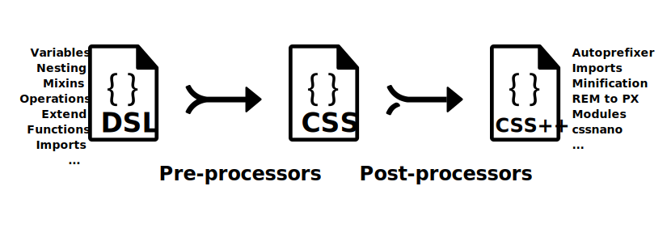

## CSS 向后兼容语言扩展/CSS extension language

### Overview

- 变量/Variables
- 运算/Operations
- 嵌套/Nesting
- 混合/Mixins
- 继承/Extend
- 内置函数/Built-In Functions
- At-Rules
- 导入/Import

### Content



CSS 处理器/CSS Processors，[Stylus](http://stylus-lang.com/)、[Less](http://lesscss.org/features/#merge-feature)、[Sass/Scss](https://sass-lang.com/guide)、[PostCSS](https://postcss.org/)

逻辑处理，动态特性，改善项目结构；

特殊语法，依赖工具链，较复杂；

#### 变量/Variables

- 默认变量
- 作用域
- 定义：`$name: value;`
- 值引用：`$name`
- 选择器/属性引用：`#{$name}`


#### 运算/Operations

- `==`, `!=`, 值比较
- `+`, `-`, `*`, `/`, `%`, 数值运算
- `<`, `<=`, `>`, `>=` 数值比较
- `and`, `or`, `not`, boolean 行为
- `+`, `-`, `/` 连接字符串


#### 嵌套/Nesting

- 父选择器/Parent Selectors `&`

#### 混合/Mixins

```scss
@mixin define-emoji($name, $glyph) {
  span.emoji-#{$name} {
    font-family: IconFont;
    font-variant: normal;
    font-weight: normal;
    content: $glyph;
  }
}

@include define-emoji("women-holding-hands", "👭");
```

```css
span.emoji-women-holding-hands {
  font-family: IconFont;
  font-variant: normal;
  font-weight: normal;
  content: "👭";
}
```

#### 继承/Extend

一个类继承另一个类的所有样式；`@extend <selector>|<%placeholder>`

有边界限制，同语义，单层级，`@media` 范围；

#### 导入/Import

局部小块文件以 `_` 开头，`_partial.scss` → `@import partial`

#### 内置函数/Built-In Functions

- Color Functions
    + `darken($color, $amount)`， 变暗，$amount: 0% ~ 100%
    + `lighten($color, $amount)`，变亮
    + `grayscale($color)`，相同亮度的灰色
    + `mix($color1, $color2, $weight: 50%)`，混合颜色
    + `adjust-color|change-color|scale-color($color,[[$red: null, $green: null, $blue: null,]|[$hue: null, $saturation: null, $lightness: null,]], $alpha: null)`
    + `adjust-hue($color, $degrees)`
    + `opacify($color, $amount)`/`fade-in($color, $amount)`，不透明，$amount: 0 ~ 1
    + `transparentize($color, $amount)`/`fade-out($color, $amount)`，透明
    + `desaturate($color, $amount)`/`saturate($color, $amount)`，饱和度 $amount： 0% and 100%
    + `invert($color, $weight: 100%)`
    + `red()`， `green()`， `blue()`， `hue()`， `saturation()`， `lightness()`， `alpha()`， `opacity()`，参数颜色，获取对应值

- Number Functions
    + `abs($number)`
    + `ceil($number)`
    + `floor($number)`
    + `round($number)`
    + `max($number...)`
    + `min($number...)`
    + `percentage($number)`
    + `random($limit: null)`
    + `comparable($number1, $number2)`，兼容单位
    + `unit($number)`，获取单位字符
    + `unitless($number)`，是否有单位

- String Functions
    + `quote($string)` / `unquote()`
    + `unique-id()`

#### At-Rules

- `@function`
- `@if <expression> { }`, `@else { }`, `@else if <expression> { }`
- `@each <variable> in <expression> { }`
- `@for <variable> from <expression> to|through <expression>`
- `@while <expression> { }`

### Additional Resources

- [Sass: Sass Basics](https://sass-lang.com/guide)

### Up Next

- [Sass: Documentation](https://sass-lang.com/documentation)
- [cssnano: A modular minifier based on the PostCSS ecosystem.](https://cssnano.co/)

### Questions?

上次考核中的 CSS 样式，将其色彩、宽高、字体、内外间距部分用 SCSS 声明；