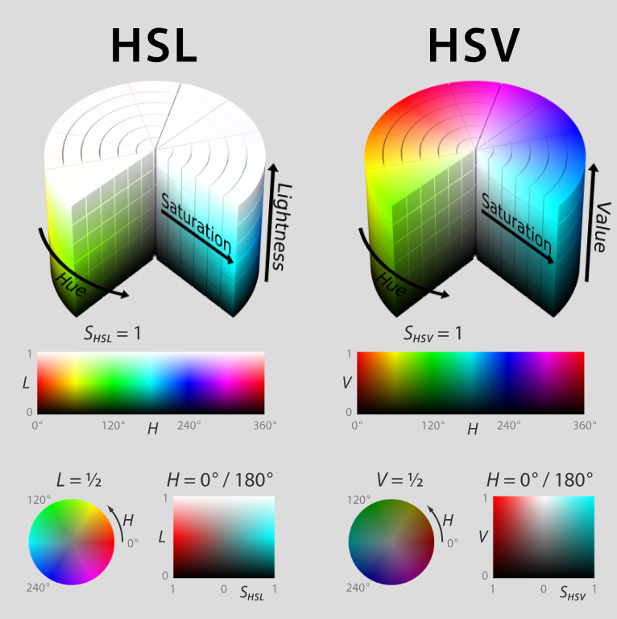

## Graphics

数字图像相关

### Overview

- RGBA, HSLA
- 位图/Bitmap
- 矢量图/Vector
- 图形文件格式
- Web font

### Content

图的组成有**像素**、**形状**，也就有了**图像**、**图形**的分区；

图像是像素图(点阵图，位图)，图像有二值图像、灰阶图像、彩色图像；

图形是矢量图；

#### 色彩空间，颜色模型，颜色通道

- RGB, RGBA, **R**ed, **G**reen, **B**lue, **A**lpha, 加色法**颜色模型**，Alpha 通道指透明度
- HSL, HSLA, 色相/**H**ue, 饱和度/**S**aturation, 明(亮)度/**L**ightness(**V**alue), 圆柱坐标系
- CMYK, **C**yan, **M**agenta, **Y**ellow, blac**K**, 彩色印刷套色模式

一张 RGB 色彩空间(8位精度)512*512像素的图像，即为一个矩阵元素`PI[512, 512, 3]`，512 列，512 行，3 个颜色分量，各分量下各个像素的灰度值(`0-255`)，表示明亮度，显示时放入对应颜色通道，呈现出“图像”；

图像处理，就是对图像进行二值化和调整灰度直方图。

#### 位图/Bitmap

使用像素表示；

位图分为 1、4、8、16、24、32 等信息位数图像；

**每个像素**使用的信息位数越**多**，可用的颜色就越**多**，颜色表现就越逼**真**，相应的数据量越**大**；

RGB(2^8)*(2^8)*(2^8) 在一个像素上可进行1677万种颜色采样，人眼对色彩的分辨能力大致是一千万色，(位深度 24，真彩色)；

索引颜色，从位图图片中选择最有代表性的若干种颜色（通常不超过256种）编制成颜色表，然后将图片中原有颜色用颜色表的索引来表示，大幅度有损压缩；

#### 直方图(Image/Color/Intensity Histogram)

- 图像直方图，亮度分布(暗、明)，了解曝光信息，标绘图像中每个亮度值的像素数
- 颜色直方图，颜色分布，覆盖该图像的整个色彩空间，标绘各个颜色区间中的像素数
- 亮度直方图，灰度图像

#### 矢量图/Vector

简单图形，XML 格式描述图形元素对象的颜色、形状、轮廓、大小和屏幕位置等属性；

- 文件大小和物理尺寸大小无关，和保存信息相关
- 与分辨率无关，缩放不影响画质

栅格化，转换成位图。

#### 图形文件格式

##### 位图

- `.png`，Portable Network Graphics，跨平台网络图形，无损压缩，支持Alpha通道
- `.gif`，Graphics Interchange Format，8位压缩(256种颜色)，支持透明和动画
- `.jpg`，Joint Photographic Experts Group，有损压缩
- `.bmp`，Windows 位图，无压缩
- `.tiff`, `.tif`，Tagged Image File Format，可有损或无损，扫描使用文档

##### 矢量图形

- `.ps`，PostScript，矢量页面描述语言
- `.eps`，Encapsulated PostScript，描述小型矢量图的PostScript文件
- `.pdf`，简化版 PostScript，
- `.ai`，Adobe Illustrator Document
- `.svg`，Scalable Vector Graphics，基于 XML 的二维矢量图格式，W3C 为浏览器定义的标准

#### Web font

- CSS 中通过 `@font-face {font-family: ""; src: url("");}` 指定 Web 字体
- `woff2`, The Web Open Font Format (WOFF 2.0)
- `woff`, The Web Open Font Format (WOFF) , Web开放字体格式
- `ttf`, TrueType Fonts (TTF)
- `svg`, Scalable Vector Graphics Fonts/Shapes (SVG) , OpenType 字体的子集, 多色, 动画
- `eot`, Embedded OpenType Fonts (EOT) , 嵌入式 OpenType 字体

字体匹配：指定的首选字体 → 回退字体 → 通用族字体，选择类似的替代字体。

### Summary/Web中图形应用

- 色彩、形状表现简单，矢量图
- 色彩细腻丰富，表现力强，位图
- 颜色呈块状，不透明，采用 PNG 8位索引色位图
- 带透明度，PNG 24位索引色位图，如果颜色丰富，用于网页时要考虑文件大小，可采用[TinyPNG](https://tinypng.com/)进行压缩
- 色彩细腻丰富，不透明，JPG；用于网页需要兼顾成像品质和压缩率
- 页面、模块配图，按比例尺寸进行**规划**、**设计**和**应用**
- Icon 小图标，处理成矢量格式
- 图片配文，要考虑文字信息内容在各设备分辨率下的呈现

### Additional Resources

- [GIMP - GNU Image Manipulation Program](https://www.gimp.org/)
- [Inkscape](https://inkscape.org/release/inkscape-0.92.4/)
- [Adobe XD | UX/UI design and collaboration tool](https://www.adobe.com/products/xd.html#)

### Up Next

- [Color Wheel](https://color.adobe.com/zh/create/color-wheel/)
- [色彩空间 - 维基百科，自由的百科全书](https://zh.wikipedia.org/wiki/%E8%89%B2%E5%BD%A9%E7%A9%BA%E9%96%93)
- [网页颜色 - 维基百科，自由的百科全书](https://zh.wikipedia.org/wiki/%E7%BD%91%E9%A1%B5%E9%A2%9C%E8%89%B2#%E7%B6%B2%E9%A0%81%E5%AE%89%E5%85%A8%E9%A2%9C%E8%89%B2)
- [快速使用OSS图片服务-阿里云](https://help.aliyun.com/document_detail/44686.html)
- [Iconfont-阿里巴巴矢量图标库](https://www.iconfont.cn/)
- [Google Fonts](https://fonts.google.com/)
- [DaFont - Download fonts](https://www.dafont.com/)
- [Ant Design 设计相关理论](https://ant.design/docs/spec/introduce-cn)
- [Microsoft Design](https://www.microsoft.com/design/fluent/#/)

### Questions?

如何处理和优化 Web 中的图标和图片？
